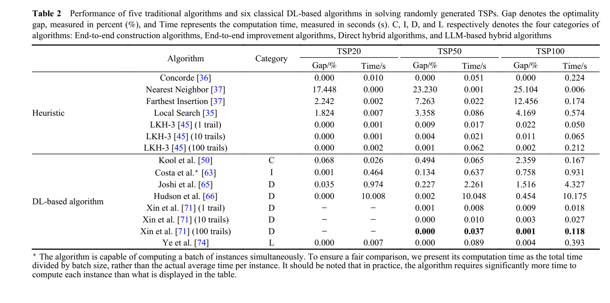
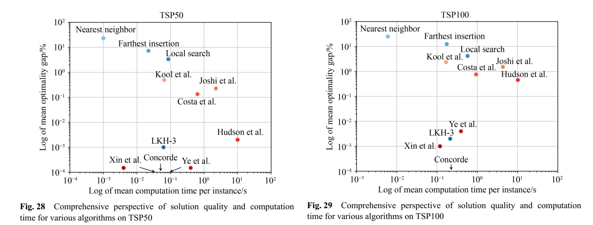
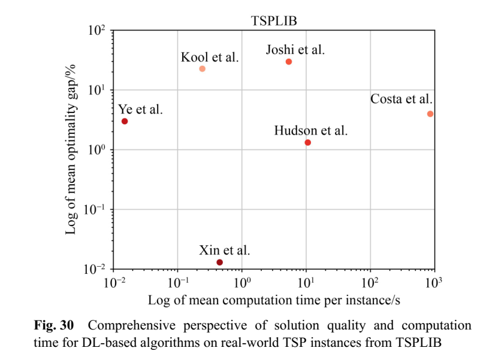

## A survey on deep learning based algorithms for TSP

### 1. **Basic Info**
- **Citations: 11**  
- **Year / Venue: 2024**  
- **Type:** Survey
- **Keywords: tsp, deep-learning, algorithm design, neural network**  

---

### 2. **Scope & Motivation / Problem addressed:** 
- Presents an overview of deep learning methods used to solve TSP, dividing it into 4 categories. 
1. End-to-end construction algorithms
2. End-to-end improvement algorithms
3. Direct hybrid algorithms
4. LLM-based hybrid algorithms

- Comparision via experiments: speed vs. solution quality

<!-- 
End-to-end  construction  algorithms  employ
neural  networks  to  generate  solutions  from  scratch,
demonstrating  rapid  solving  speed  but  often  yielding  subpar
solutions.  Conversely,  end-to-end  improvement  algorithms
iteratively  refine  initial  solutions,  achieving  higher-quality
outcomes  but  necessitating  longer  computation  times.  Direct
hybrid algorithms directly integrate deep learning with heuristic
algorithms,  showcasing  robust  solving  performance  and
generalization  capability.  LLM-based  hybrid  algorithms
leverage LLMs to autonomously generate and refine heuristics,
showing  promising  performance  despite  being  in  early
developmental stages
Notes -->
---

#### 2.1 **Why important / relevant:**  
- Recent: Was released in 2024, covers various ways AI systems have been used to solve the tsp
#### 2.2 **Variant (TSP, VRP, VRPTW, etc.):**  
- Mainly addresses tsp, but the algorithms it talks about can be extended to vrp and vrptw or are already applied there as well
#### 2.3 **Research gap / challenge highlighted:**  
- Scalability and interpretability, cost of supervised learning, potentail of LLMs

---

### 3. Contributions
#### 3.1 **Main idea / approach:**  
- Divide algorithms into 4 categories - end to end construction, end to end improvement, direct hybrid and LLM hybrid
#### 3.2 **Difference from prior work:**
- They cover many more algorithms, and perform experiments on representatives algorithms from each category.
---
#### 3.3 **Key methods / algorithms (survey: categories; primary: proposed method):**  
They perform experiments with the following algorithms: 
  - End to end construction: Kool  W,  Van  Hoof  H,  Welling  M.  Attention,  learn  to  solve  routing
problems!2018, arXiv preprint arXiv: 1803.08475
  - End to end improvement: Costa  P  R  D  O,  Rhuggenaath  J,  Zhang  Y,  Akcay  A.  Learning  2-opt
heuristics  for  the  traveling  salesman  problem  via  deep  reinforcement
learning.  In:  Proceedings  of  the  12th  Asian  Conference  on  Machine
Learning. 2020, 465–480
---
- Direct hybrd: 
  - Joshi  C  K,  Laurent  T,  Bresson  X.  An  efficient  graph  convolutional
    network  technique  for  the  travelling  salesman  problem.  2019,  arXiv
    preprint arXiv: 1906.01227
  - Hudson B, Li Q, Malencia M, Prorok A. Graph neural network guided
      local search for the traveling salesperson problem. 2021, arXiv preprint
      arXiv: 2110.05291
  - Xin L, Song W, Cao Z, Zhang J. NeuroLKH: combining deep learning
      model with Lin-Kernighan-Helsgaun heuristic for solving the traveling
      salesman  problem.  In:  Proceedings  of  the  35th  International
      Conference on Neural Information Processing Systems. 2021, 572
---
- LLM based: Ye H, Wang J, Cao Z, Berto F, Hua C, Kim H, Park J, Song G. Large
language  models  as  hyper-heuristics  for  combinatorial  optimization.
2024, arXiv preprint arXiv: 2402.01145
---

### 4. Experimental Details 
#### **Datasets and Methodology:**  
- They generate random instances of TSP 20/50/100 and 200, use TSPLIB, and compare the generalizability of algorithms by evaluating performance of algorithms trained on smaller number of TSP problems and employing them on bigger ones. They also evaluate performance on TSPLIB datasets.
- Comparison Criteria: The  optimality  gap, defined  as  the  percentage  difference  between  the  lengths  of solutions obtained by each algorithm and the lengths of exact solutions obtained by the Concorde solver. Compute time was also documented.

---

### 5. Results & Findings
#### **Performance results:**  
- Direct hybrid algorithms outperform end to end construction and improvement algorithms for real world TSPs
- Overall, hybrid algorithms exhibit
better generalization performance compared to DL-based endto-end construction and improvement algorithms.
---
- **Comparisons made:**  

---

---

---
- **Strengths / advantages:**  
- **Weaknesses / limitations:**  

---

### 6. Critical Insights
- **What does this paper add to my understanding?**  
- Hybrid algorithms are currently the best performers w.r.t algorithms using AI systems. 
- LLMs based algorithms are promising, NeuroLKH performs very good - should be studied further?

---
#### **Future directions suggested:**
- Scalability to Large-Scale TSPs
  - Design architectures and training methods that scale efficiently to tens of thousands of nodes.  
  - Explore graph neural networks (GNNs) with hierarchical structures or sparse attention to handle large inputs.

- Hybridization with Classical Methods
  - Deepen integration of DL with advanced heuristics (e.g., LKH, GLS, branch-and-bound) to combine global learning with local refinement.  
  - Develop adaptive hybrid frameworks where DL dynamically selects or configures heuristics based on problem features.

---

- LLM-Enhanced Algorithm Design
  - Use LLMs to generate, refine, and explain heuristics automatically, potentially enabling zero-shot algorithm synthesis.  
  - Explore co-training LLMs with graph-based models to combine symbolic reasoning with numerical optimization.

- Interpretability & Trustworthiness
  - Develop explainable DL architectures that highlight decision rationales (e.g., why a node or edge is chosen).  
  - Provide visualizations and rule extraction methods to build user confidence.

---

- Generalization & Robustness
  - Focus on cross-distribution generalization (e.g., TSP instances with different spatial structures, constraints, or noise).  
  - Employ domain adaptation, transfer learning, and meta-learning to reduce retraining costs on new problem families.

- Integration of Theoretical Guarantees
  - Combine data-driven approaches with approximation theory to yield provable error bounds alongside empirical performance.  
  - Explore probabilistic guarantees (e.g., PAC-style bounds) tailored for combinatorial optimization.
---
- Multi-Objective & Real-World Extensions
  - Extend DL-based solvers beyond classical TSP to vehicle routing problems (VRPs), dynamic routing, and stochastic constraints.  
  - Incorporate real-world factors like time windows, capacity, energy consumption, and uncertainty.
---
### Key Challenges Ahead

Scalability vs. Solution Quality
- Larger problem sizes often degrade solution quality or inflate computation time; balancing both remains difficult.

Training Data Limitations
- Generating high-quality supervised data (optimal solutions) is expensive; reinforcement learning approaches often converge slowly.

Worst-Case Performance
- Current DL models excel in average-case scenarios but lack guarantees for worst-case instances, limiting adoption in critical domains.
---
Overfitting to Instance Distributions
- Many models fail to generalize when problem distributions (node placement, cost structure) differ from training data.

Interpretability Gap
- Neural decision-making in TSP remains opaque, hindering trust and deployment in sensitive real-world contexts (e.g., logistics).

Computational Resource Demands
- Training large neural models or hybrid systems can be prohibitively expensive, raising barriers for practical deployment.

Nascent State of LLM-based Approaches
- While promising, LLM-based hybrids are still experimental and lack systematic evaluation against established solvers.

---

### 7. Relevance to My Work
- **Connection to my research question / theme:**  
- In terms of what methods (using AI) are currently used in combiatorial optimization - this paper collects a list of 32 algorithms,
compares the 6 representative algorithms from the 4 categories against each other and against traditional methods/solvers such as Concorde, LKH etc

- **Which section of my literature review could this fit under?:**  
- From the 4 categories proposed by them, based on the performance, we can focus more deeply on direct hybrid algorithms.
- We can try to find more algorithms under this category, and develop some subcategories within this.
---
- **Other papers I should check (from references):**  
- NeuroLKH - because of its performance, LLM Based Ye et als algorithm - interesting, NeuroGLS also seems interesting because
it combines Graph NN with Guided local search. 

- They also mention 3 survey papers, which might be interesting:
- Junior  Mele  U,  Maria  Gambardella  L,  Montemanni  R.  Machine
learning approaches for the traveling salesman problem: a survey. In:
Proceedings  of  the  8th  International  Conference  on  Industrial
Engineering and Applications (Europe). 2021, 182–186
---
- Shi  Y,  Zhang  Y.  The  neural  network  methods  for  solving  traveling
salesman problem. Procedia Computer Science, 2022, 199: 681−686
- Yang  Y,  Whinston  A.  A  survey  on  reinforcement  learning  for
combinatorial  optimization.  In:  Proceedings  of  IEEE  World
Conference on Applied Intelligence and Computing. 2023, 131–136

### Todo
Summarize long paragraphs into points, and put the text as notes.
Add references/links to the papers
Describe the tables/plot charts more
