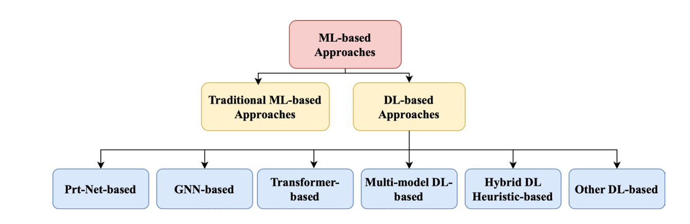
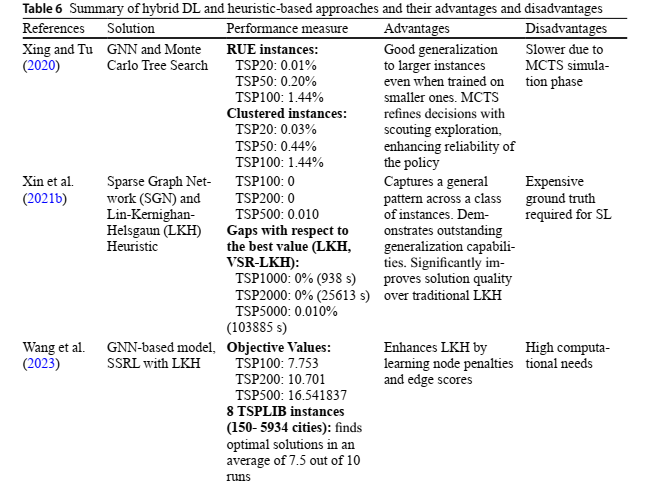
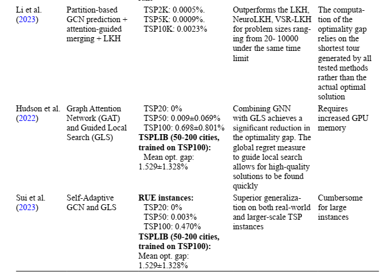
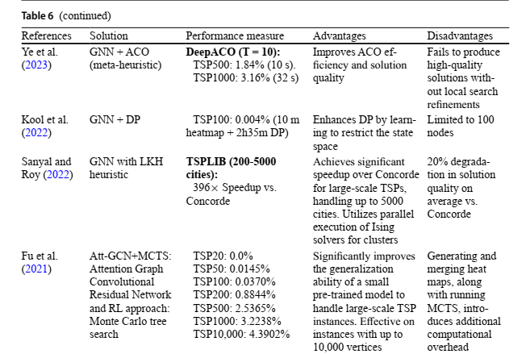
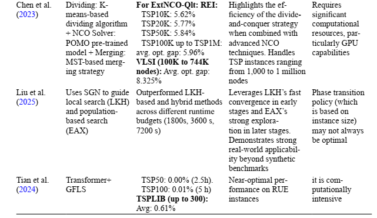

# Solving the traveling salesman problem with machine learning: a review of recent advances and challenges Notes

---

### 1. Basic Info
- **Citations: 4**  
- **Year: 2025**  
- **Type: Survey** 
- **Keywords: Traveling salesman problem · Machine learning · Deep learning · Graph neural network · Transformers**  

---

### 2. Scope & Motivation
#### **Problem addressed:**  The paper reviews how machine learning (ML) methods are being applied to solve the Traveling Salesman Problem (TSP). 
<!--
TSP is a classic NP-hard optimization problem where the goal is to find the shortest route visiting all cities exactly once and returning to the start . It examines traditional ML, deep learning (DL), and hybrid approaches, analyzing their strengths, limitations, and scalability-->
---

#### Why this paper:

They provide a detailed analysis of the strengths and limitations of each approach in terms of scalability, computational efficiency, solution quality, and generalization to largescale instances. This analysis is supported by comparative tables and insightful discussions to enhance clarity and depth.

---

#### **Challenges highlighted:**  

Scalability: DL models perform well on small/medium TSP but struggle with large-scale instances due to memory and computational limits.

Generalization: Many models fail on unseen instance sizes/distributions, limiting real-world usability.

Dependence on heuristics: Hybrid ML-heuristic approaches improve quality but require expert integration, reducing flexibility.

Data limitations: Reliance on synthetic or TSPLIB datasets limits real-world applicability.

Learning paradigms: SL and RL face trade-offs (data needs, sparse rewards, slow convergence); hybrid paradigms like SSRL, Weakly-SL, and self-improved learning are promising but still underexplored.

---

### 3. Model Based Perspective 

Hybrids outperform GNNs/Transformers on very large TSP instances.
Prt-Net-Based, Other-Methods and Multi-Modal - not that good (for now)

---

#### Summary

| Model / Paper | TSPLIB / Large-Scale Performance | Strengths | Limitations | Relative to Others |
|---------------|---------------------------------|-----------|-------------|-----------------|
| NeuroLKH (Xin et al., 2021b) | Up to 5000 nodes | Efficient, generalizes well | Needs SGN training, depends on distributions | Better than LKH/VSR-LKH; mid-scale strong |
| SSRL (Wang et al., 2023) | 10k+ nodes | Self-supervised, high generalization | Complex dual-decoder | Outperforms NeuroLKH, LKH, VSR-LKH |
---
| Model / Paper | TSPLIB / Large-Scale Performance | Strengths | Limitations | Relative to Others |
|---------------|---------------------------------|-----------|-------------|-----------------|
| Li et al., 2023 | 20 → 10k nodes | Divides & merges → high generalization | Expensive attention | Outperforms most prior DL+LKH hybrids |
| Hudson et al., 2022 / NeuralGLS | Small-medium | Edge-focused learning, reduces gaps | High GPU, SL reliance | Good for small-medium TSPLIB; not best for large |

---
| Model / Paper | TSPLIB / Large-Scale Performance | Strengths | Limitations | Relative to Others |
|---------------|---------------------------------|-----------|-------------|-----------------|
| DeepACO (Ye et al., 2023) | Up to 1000 nodes | Learned heuristics + metaheuristics | Slower for large instances | Mid-sized TSP; less scalable than NeuroLKH/SSRL |
| UNiCS (Liu et al., 2025) | 10k–71k nodes | Two-stage hybrid; flexible | Complex pipeline | Best for ultra-large, diverse TSPLIB |

---

| Model / Paper | TSPLIB / Large-Scale Performance | Strengths | Limitations | Relative to Others |
|---------------|---------------------------------|-----------|-------------|-----------------|
| Transformer + GFLS (Tian et al., 2024) | ≤300 nodes | Near-zero gaps | Small-scale only | Excellent for small TSP, limited scalability |
| ExtNCO (Chen et al., 2023) | 1k–1M nodes | Linear-time divide & conquer; <6% gap | Dependent on sub-tour accuracy | Competes with UNiCS; highly scalable |

---
 
- **Datasets / benchmarks mentioned:**  
Mentions 2 new benchmark Datasets which can be used:
1. Very large-scale integration (VLSI) instances (Rohe 2013): Derived from the
challenges in designing integrated circuits, these instances are typically complex
and feature thousands to tens of thousands of nodes, making them suitable for testing the scalability of TSP algorithms (Liu et al. 2023).
2. National instances (Cook 2022): Based on real-world geographic data, these
instances model the practical challenges of routing and logistics across actual city
locations within a specific country.

---

Also mentions:

Data generation: Instances are generated to encompass a wide range of problem characteristics:
1. Uniform random euclidean (RUE) instances: These instances are generated uniformly by placing points on a two-dimensional plane.
2. Clustered instances (CLU): These instances are generated by randomly placing
points around different central points.

Although the clustered instances are not very common

---

### 4. Discussion 

---

### 5. Critical Insights
- **What does this paper add to my understanding?**
Mainly confirms that Hybrid methods are currently better than purely AI approaches, most hybrid methods use Graph neural networks. There does not seem to be similar styled survey on VRP or VRPTW, which is a research gap.
---

- **Open problems or challenges mentioned:**  

- **Future directions suggested:**  
Reinforcement learning is being investigated more because it does not require labelled training data.
Scalability: Models are being trained on smaller instances, and evaluated on larger ones.
For GNNs - research on graph reduction techniques
Graph transformers are also a new field

---

### 6. Relevance to My Work
- **Connection to my research question / theme:**
Added 3 new methods that can be benchmarked against each other for VRPTW. 
Additionally, they can be compared against PyVRP and CuOpt.

Currently, there is a list of 6 methods using AI which have promising resutls, the next steps would be to check if they can be extended to VRPTW, if it makes sense to train them, and benchmark them.

---

- **Which section of my literature review could this fit under?:**  
I think the methods from these, which already have a vrptw implementation can be described better, while also describing some benchmark methods such as CuOpt, PyVRP and more.

- **Other papers I should check (from references):**  
It seems NeuroLKH, NeuroGLS, Ising, and the 3 new methods mentioned should be studied more in depth and analyzed if it makes sense to use them.

---

Tables from paper 

---

### Table for Hybrid Approaches

---

---

---

---

